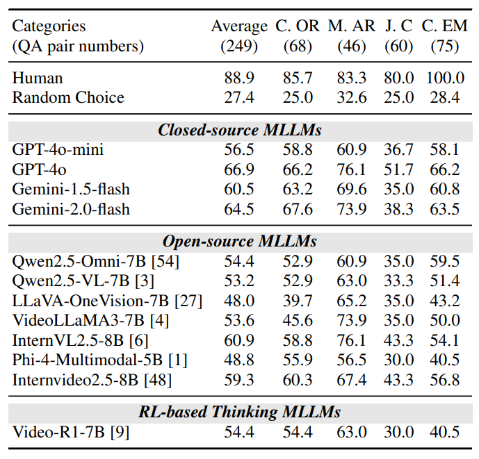
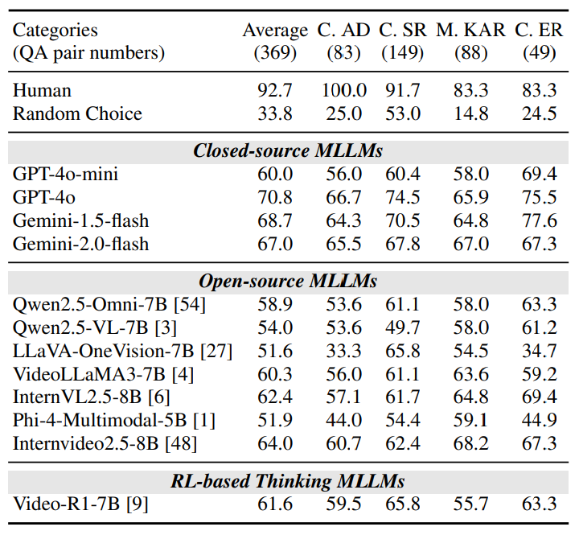

# 🎬 CVBench: Evaluating Cross-Video Synergies for Complex Multimodal Understanding and Reasoning

<p align="center">
        🤗 <a href="https://huggingface.co/datasets/Dongyh35/CVBench">Dataset</a> &nbsp&nbsp | &nbsp&nbsp 📑 <a href="http://arxiv.org/abs/2508.19542">Paper</a> &nbsp&nbsp 
</p>

<div align="center">

**🚀 The first benchmark for cross-video multimodal reasoning evaluation 🚀**

</div>

## 👀 CVBench Overview

<p align="center">
    
</p>

In the quest for artificial general intelligence, Multi-modal Large Language Models (MLLMs) have emerged as a focal point in recent advancements, but their potential in processing **cross-video relationships** is still insufficiently explored. We introduce **CVBench**, the first-ever comprehensive evaluation benchmark for **cross-video multimodal reasoning** in MLLMs.

**CVBench** is designed specifically for **cross-video multimodal reasoning**, testing whether MLLMs can reason across multiple videos that are asynchronous, multi-view, or contextually related. Our work distinguishes from existing benchmarks through four key features:

### 🚀 Key Features

⭐ **📈 Comprehensive Dataset**  
- **1,000 QA pairs** carefully curated for cross-video reasoning
- From **1,315 high-quality videos** across diverse domains
- **15 distinct task types** covering various reasoning scenarios

🎨 **🌍 Diverse Domains**  
Covering domains like **sports**, **surveillance**, **cooking**, **tutorials**, **cartoons**, and **news** to ensure comprehensive evaluation.

🔗 **🎭 Multi-Video Relationships**  
Testing **asynchronous**, **multi-view**, and **contextually related** video understanding capabilities.

📊 **🎯 Cross-Video Task Categories**  
- **Object Association**: Cross-video object recognition, multi-video attribute recognition, joint-video counting, cross-video entity matching
- **Event Association**: Cross-video anomaly detection, scene recognition, key-action recognition, event retrieval  
- **Complex Reasoning**: Multi-view scene understanding, temporal reasoning, spatial navigation, difference captioning, counterfactual reasoning, summarization, procedural transfer

You can learn more about CVBench in the [dataset README](https://huggingface.co/datasets/Dongyh35/CVBench).

## 📐 Dataset Examples

<p align="center">
    
</p>

Our dataset showcases diverse cross-video reasoning scenarios across three core task categories: **object association** (identifying shared entities across multiple viewpoints), **event correlation** (linking temporal or causal chains between videos), and **complex reasoning** (integrating commonsense understanding of interrelationships). Each example demonstrates the complexity of reasoning required when models must understand relationships that span across different video contexts.

---

## 📦 What's in This Repo

> ⚠️ **Important Notice**  
> This repository is **based on and adapted from two excellent open-source evaluation platforms**:  
> - [EvolvingLMMs-Lab/lmms-eval](https://github.com/EvolvingLMMs-Lab/lmms-eval)  
> - [tulerfeng/Video-R1](https://github.com/tulerfeng/Video-R1)  
>   
> We do **not claim ownership** of the original frameworks. We only made **task-specific modifications** to support the evaluation of our dataset, [**CVBench**](https://huggingface.co/datasets/Dongyh35/CVBench), which focuses on cross-video reasoning in multimodal large language models (MLLMs).

This repository contains code adapted from `lmms-eval` and `Video-R1`, with the following **modifications**:

- ✅ Prompts for **multiple videos per question**
- ✅ Preprocessing changes to include **start/end frame padding**
- ✅ Custom evaluation pipelines for **multiple-choice** and **yes/no** questions

---

## ⚡ Getting Started

### Clone this repo

```bash
git clone https://github.com/Hokhim2/CVBench.git
cd CVBench
```

---

## 🎮 Usage

Since our work focuses on **multi-video evaluation with large models**, we made modifications based on the official codebase to support multi-video inputs. Please refer to `Video-R1/src/eval_bench.py` for detailed implementation.

### 🎬 Video-R1 Evaluation

> 📂 Ensure that your **video dataset** and the corresponding **JSON annotation file** are placed under `Video-R1/src/r1-v/Evaluation/`.
> Please organize the video data in the following directory structure:
> ```
> Video-R1/
> ├── src/
> ├──├──r1-v/
> ├──├──├──Evaluation/
> ├──├──├──├──CVBench.json
> ├──├──├──├──CVBench/
> ├──├──├──├──├──0/...
> ```
```bash
# Build environment
cd Video-R1
bash setup.sh
cd src/qwen-vl-utils
pip install -e .[decord]
cd ..

# Run evaluation
bash ./src/eval_bench.sh
```

### 🔬 lmms-eval Evaluation

> ⚠️ **Dataset Configuration**: Ensure that your **video dataset** and the corresponding **hf_format_dataset in `lmms-eval/lmms_eval/tasks/mvr/mvr.yaml`** match.
> 
> **Configuration Details**:
> - `dataset_path: ../mvr_dataset` - Points to the **HuggingFace format dataset** containing QA pairs and metadata
> - `cache_dir: ../Video-R1/src/r1-v/Evaluation/CVBench` - Points to the **video files directory** where actual video data is stored
> 
> Make sure both paths are correctly configured to match your local setup.

```bash
# Build environment
cd lmms-eval
pip install -e .

# Run evaluation
# Note: Model implementations are available in lmms-eval/lmms_eval/models/
# Replace 'your_model' with the specific model name (e.g., qwen2_5_vl)
python3 -m accelerate.commands.launch \
    --num_processes=1 \
    -m lmms_eval \
    --model your_model \
    --tasks mvr \
    --batch_size 1 \
    --output_path ./logs/

# Example with Qwen2.5-VL model:
python3 -m accelerate.commands.launch \
    --num_processes=1 \
    -m lmms_eval \
    --model qwen2_5_vl \
    --tasks mvr \
    --batch_size 1 \
    --output_path ./logs/
```

---

## 📈 Experimental Results

### Cross-Video Object Association

<p align="center">
    
</p>

**Performance of MLLMs on CVBench regarding cross-video object association**, evaluated across closed-source and open-source MLLMs. Tasks include: cross-video object recognition (C.OR), multi-video attribute recognition (M.AR), joint-video counting (J.C), and cross-video entity match (C.EM). For human evaluation, we employed five annotators and reported the average accuracy.

### Cross-Video Event Association

<p align="center">
    
</p>

**Performance of MLLMs on CVBench regarding cross-video event association**, evaluated across closed-source and open-source MLLMs. Tasks include: cross-video anomaly detection (C.AD), cross-video scene recognition (C.SR), multi-video key-action recognition (M.KAR), and cross-video event retrieval (C.ER). For human evaluation, we employed five annotators and reported the average accuracy.

### Cross-Video Complex Reasoning

<p align="center">
    
</p>

**Performance of MLLMs on CVBench in cross-video complex reasoning tasks**, evaluated across closed-source and open-source MLLMs. The tasks include: multi-view scene understanding (M.SU), multi-video temporal reasoning (M.TR), joint-video spatial navigation (J.SN), video difference captioning (VDC), cross-video counterfactual reasoning (C.CR), joint-video summarization (J.S), and cross-video procedural transfer (C.PT).

Our evaluation results demonstrate the effectiveness of CVBench in assessing cross-video reasoning capabilities across different multimodal large language models. The comprehensive evaluation reveals significant performance gaps between current MLLMs and human-level understanding in cross-video scenarios.

## 💝 Acknowledgements

We sincerely thank the contributions from the open source community, including the awesome works of:
- [EvolvingLMMs-Lab/lmms-eval](https://github.com/EvolvingLMMs-Lab/lmms-eval)
- [tulerfeng/Video-R1](https://github.com/tulerfeng/Video-R1)


## 📚 Citation

If you find CVBench useful in your research, please consider citing:

```bibtex
@misc{cvbench2025,
  title={CVBench: A Benchmark for Cross-Video Multimodal Reasoning},
  author={CVBench Team},
  year={2025},
  url={https://huggingface.co/datasets/Dongyh35/CVBench}
}
```

---

<div align="center">

**⭐ Star this repo if you find it helpful! ⭐**

</div>
